> 1. The programmer said: "There must be a repository," and Codex initialized the repository. This was the first hour.
>
> 2. The programmer said: "There must be separation between code—keep entry points and implementations apart," so 'src', 'test', and 'docs' each took their place. This was the second hour.
>
> 3. The programmer said: "There must be interfaces so people know how to use it." Thus types and contracts became clear. This was the third hour.
>
> 4. The programmer said: "There must be tests to distinguish runnable from non-runnable." So the reds grew fewer and the greens more. This was the fourth hour.
>
> 5. At dusk, while he and thirteen subagents reviewed the code, Codex said to him: "5-hours limit reached. reset 9pm." He then stopped working.
> 
> ***Create new folder***

  <!-- dynamic typing effect 动态打字效果 -->
  

    
  

  
 

 
 
  

🧠 学习计划

🧰 常用工具

<!--  -->

